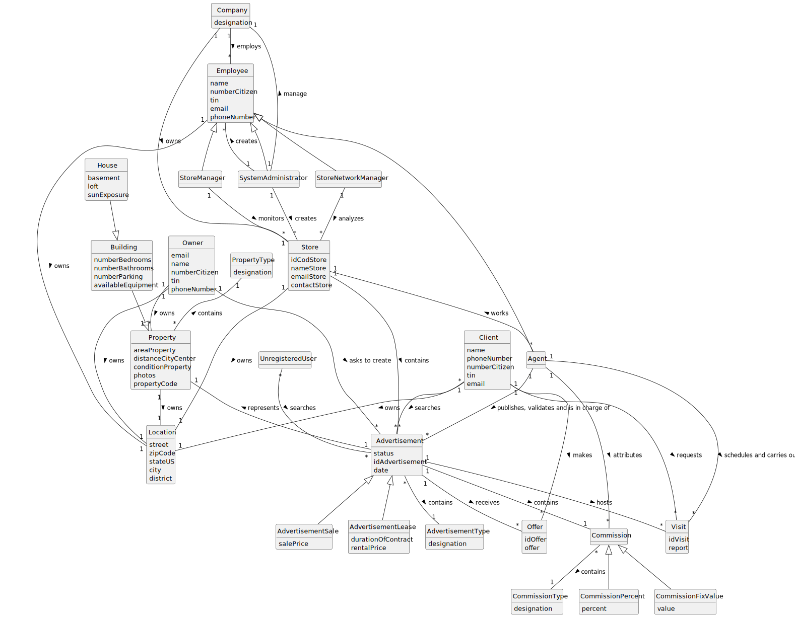

# Analysis

The construction process of the domain model is based on the client specifications, especially the nouns (for _concepts_) and verbs (for _relations_) used. 

## Rationale to identify conceptual classes used in the domain ##
To identify the conceptual classes, start by making a list of possible conceptual classes inspired by the list of categories suggested in the book "Applying UML and Patterns: An Introduction to Object-Oriented Analysis and Design and Iterative Development". 

### _Conceptual Class Category List_ ###

**Business Transactions**

* Offer

---

**Transaction Line Items**

* Property

---

**Product/Service related to a Transaction or Transaction Line Item**

* Offer (Clients make offers to the advertisements)
* Property (Owners puts properties to sell or lease)

---

**Transaction Records**

* Offer (Client makes an offer and its declined or accepted by the owner)

---  

**Roles of People or Organizations**

* System Administrator
* Agent
* Store Manager
* Store Network Manager
* Client
* Owner
* Unregistered User

---

**Places**

* Store
* Property

---

**Noteworthy Events**

* Advertisement
* Visit
* Offer

---

**Physical Objects**

* Property

---

**Descriptions of Things**

* Property Type (The property is a land, house or apartment)
* Advertisement Type (Sale or Lease) 

---

**Catalogs**

* Advertisements

---

**Containers**

* Store (Store contains all the information about the advertisements)

---

**Elements of Containers**

* Store (id, name, email, contact, location)

---

**Organizations**

*  Real Estate USA

---

**Other External/Collaborating Systems**

*  

---

**Records of finance, work, contracts, legal matters**

* Company
* System Administrator
* Store Network Manager
* Store Manager

---

**Financial Instruments**

*  

---

**Documents mentioned/used to perform some work/**

*

---

### **Rationale to identify associations between conceptual classes** ###

An association is a relationship between instances of objects that indicates a relevant connection and that is either worth remembering, or is present in the List of Common Associations: 

+ **_A_** is physically or logically part of **_B_**
+ **_A_** is physically or logically contained in/on **_B_**
+ **_A_** is a description for **_B_**
+ **_A_** known/logged/recorded/reported/captured in **_B_**
+ **_A_** uses or manages or owns **_B_**
+ **_A_** is related with a transaction (item) of **_B_**
+ etc.

| Concept (A)          |               Association                |          Concept (B) |
|----------------------|:----------------------------------------:|---------------------:|
| Company              |                   Owns                   |                Store |
| Company              |                 Employs                  |             Employee |
| Company              |              Is Managed by               | System Administrator |
| Agent                |                 Works in                 |                Store |
| Owner                |                   Owns                   |             Property |
| Agent                | Publishes, validates and is in charge of |        Advertisement |
| StoreManager         |                 Monitors                 |                Store |
| Property             |                   Owns                   |             Location |
| StoreNetworkManager  |                 Analyzes                 |                Store |
| Advertisement        |                 Receives                 |                Offer |
| Client               |                  Makes                   |                Offer |
| Store                |                   Owns                   |             Location |
| Advertisement        |                  Hosts                   |                Visit |
| Client               |                 Requests                 |                Visit |
| Agent                |        Schedules and carries out         |                Visit |
| Property             |            Is represented by             |        Advertisement |
| Client               |                   Owns                   |             Location |
| Employee             |                   Owns                   |             Location |
| Owner                |                   Owns                   |             Location |
| Store                |                 Contains                 |        Advertisement |
| Unregistered User    |                 Searches                 |        Advertisement |
| System Administrator |                 Creates                  |                Store |
| System Administrator |                 Creates                  |             Employee |
| Client               |                 Searches                 |        Advertisement |
| Owner                |              Asks to create              |        Advertisement |
| Property             |                 Contains                 |         PropertyType |
| Advertisement        |                 Contains                 |    AdvertisementType |
| Commission           |                 Contains                 |       CommissionType |
| Advertisement        |                 Contains                 |           Commission |
| Agent                |                Attributes                |           Commission |

## Domain Model

**Do NOT forget to identify concepts atributes too.**

**Insert below the Domain Model Diagram in a SVG format**

