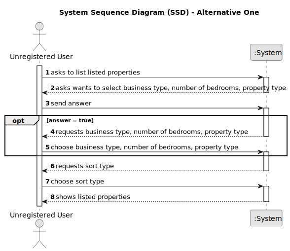

# US 001 - Display Listed Properties 

## 1. Requirements Engineering

### 1.1. User Story Description

As an unregistered user, I want to display listed properties.

### 1.2. Customer Specifications and Clarifications 

**From the specifications document:**

>	The real estate agent reviews advertisement requests, registers the information in the system and publishes the offer so that it is visible to all clients who visit the agency and use the application. All registered information, except the agency commission, can be accessed by the client who intends to buy or rent the property; the client is, then, responsible for being able to consult the properties by type, number of rooms, and sort by criteria such as price or the parish where the property is located.

**From the client clarifications:**

> **Question:** In the project's documentation it's mentioned that "All those who wish to use the application must be authenticated", but in the US1 it's said that an unregistered user can see a list of properties. Can users who aren't authenticated do this?
>  
> **Answer:** Non-authenticated users can only list properties.

> **Question:** The properties can be in sale and lease at the same time?
>  
> **Answer:** No. 

> **Question:** In the project description it is stated that "the client is, then, responsible for being able to consult the properties by type, number of rooms, and sort by criteria such as price or the parish where the property is located.". Is the client able to sort properties by only these 4 criteria or is he able to sort properties by any of the properties' characteristics?
>
> **Answer:** The client should be able to select the type of business (renting or buying), the type of property and the number of rooms. Then, the client should be able to sort properties by price or by parish where the property is located.
If the client does not select the type of business, the type of property and the number of rooms, the application should allow the client to sort all properties that are on sale or on renting.

> **Question:** When an unregistered user opens the application, are there already properties being listed?
>If the answer is "YES": then by default, by which criteria are the properties listed?
>If the answer is "NO": is it mandatory for the user to choose an option (type, number of rooms) or can he/her simply request to view a list of properties that will be automatically ordered, for example, by "most recent"?
>
> **Answer:** I already clarified what the unregistered user will see and what he can do within the application. If the system does not contain any properties, the system should show an empty list of properties.

> **Question:** The property size, location and type are typed or selected in order to filter the results?
>
> **Answer:** The client should be able to select (from a list) the type of business, the type of property and the number of rooms.

> **Question:** When a unregistered user wants to list properties, the list given by the program is sorted by default with which criteria? For example the list is shown with the properties sorted by most recently added?
>
> **Answer:** Thank you for your suggestion. By default, the list should be shown with the properties sorted by most recently added.

> **Question:**  Can an user filter the properties list for example by a type but choosing multiple values? For example the users wants to see only properties with 3 or 4 rooms. If this is possible, after filtering the list to show only the values chosen, he can sort by ascending/descending?
>
> **Answer:** The user should select only one value for each feature of the property. By default, the list should be shown with the properties sorted by most recently added.

> **Question:**  The one of the search criteria is "number of rooms". Is "Number of Bedrooms" or "Number of Bathrooms" or both?
>
> **Answer:**  Number of Bedrooms

> **Question:** In a previous question, you said that the address doesn't include parishes ("In the USA, the addresses will not include municipalities or parishes."). That being said, how should we sort the properties by location, specifically city, and state?
>
> **Answer:**  The client should be able to sort properties by price, city and state

### 1.3. Acceptance Criteria

* **AC1:** Unregistered user must choose sort type.
* **AC2:** Unregistered user can choose business type, property type and number of bedrooms.

### 1.4. Found out Dependencies

* None

### 1.5 Input and Output Data

**Input Data:**

* Typed data:
	* None
	
* Selected data:
    * Choosing business type (sell or lease)
    * Choosing type of property
    * Choosing number of bedrooms
    * Choosing sort type

**Output Data:**

* List of listed properties

### 1.6. System Sequence Diagram (SSD)

### 1.7 Other Relevant Remarks

* Unregistered users can only see the listed properties. They can't bid on properties unless they authenticate. 