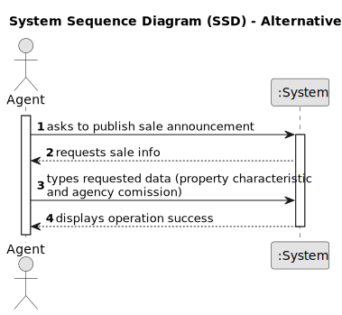

# US 002 - Publish Sale Announcement 

## 1. Requirements Engineering

### 1.1. User Story Description

As an agent, I can publish any sale announcement on the system, for
example received through a phone call.

### 1.2. Customer Specifications and Clarifications 

**From the specifications document:**

>	Upon receiving the order, the agent sets the commission and publishes the offer in the system. The commission can be a fixed ammount or a percentage.

>	The real estate agent reviews advertisement requests, registers the information in the system and publishes the offer so that it is visible to all clients who visit the agency and use the application. All registeres information, except the agency commission, can be acessed by the client who intends to buy or rent the property: the client is, then, responsible for being able to consult the properties by type, number of rooms, and sort by criteria such as price or the parish where the property is located. 

**From the client clarifications:**

> **Question:** Is the phone call the only way the agent can receive the sale announcement? Or he can receive them via e-mail/letter/etc
>  
> **Answer:** 

### 1.3. Acceptance Criteria

* **AC1:** The Agent must be a registered employee.
* **AC2:** Using a reference that is a match to an already existing listing, or inputting the property information directly.
* **AC3:** When inputting the property information directly, the information must be in accordance to the requirements.
* **AC4:** All required fiels must be filled in.

### 1.4. Found out Dependencies

* There is a dependency to "US003 Registering a new employee" since an agent needs to be a registered employee so as to be able to publish the offer.

* There is a dependency to "US004 Submitting a request" as there needs to exist a listing request for it to be reviewed and accepted.

### 1.5 Input and Output Data

**Input Data:**

* Typed data:
	* reference, 
	* agency commission,
	* house properties

**Output Data:**

* (In)Success of the operation

### 1.6. System Sequence Diagram (SSD)

**Other alternatives might exist.**

#### Alternative One

#### Alternative Two

### 1.7 Other Relevant Remarks

* This task can be performed either from a listing created by an owner in the application, or by the agent in direct contact with the owner, as is the case when an owner meets an agent in one of the company's branches.