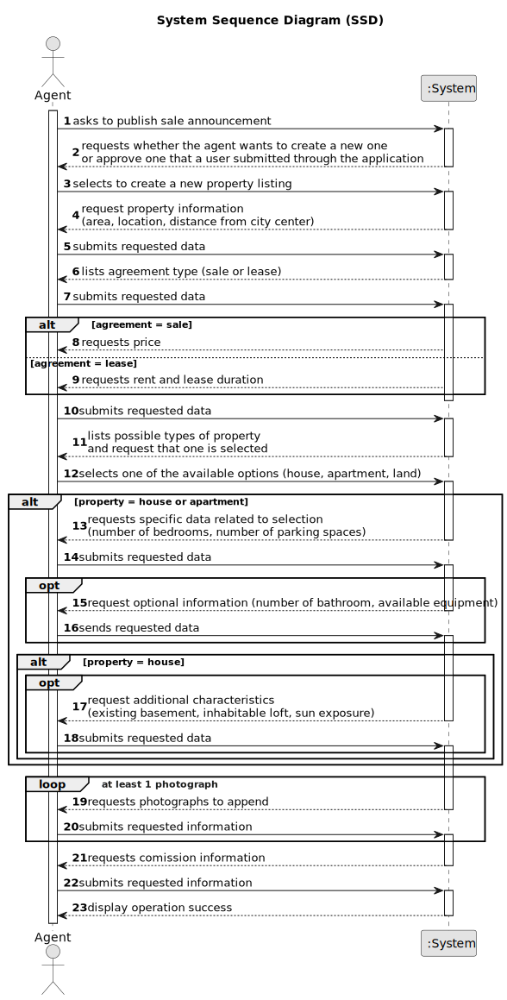

# US 002 - Publish Sale Announcement 

## 1. Requirements Engineering

### 1.1. User Story Description

As an agent, I can publish any sale announcement on the system, for
example received through a phone call.

### 1.2. Customer Specifications and Clarifications 

**From the specifications document:**

>	Upon receiving the order, the agent sets the commission and publishes the offer in the system. The commission can be a fixed ammount or a percentage.

>	The real estate agent reviews advertisement requests, registers the information in the system and publishes the offer so that it is visible to all clients who visit the agency and use the application. All registeres information, except the agency commission, can be acessed by the client who intends to buy or rent the property: the client is, then, responsible for being able to consult the properties by type, number of rooms, and sort by criteria such as price or the parish where the property is located. 

**From the client clarifications:**

> **Question:** Is it necessary to publish the owner atributes on the sale announcement? 
> 
> **Answer:** No

> **Question:** About the agent comission. What is the value for the fixed amount comission? Is it the same for all agents?
>
> **Answer:** The commission is for the agency and for that given property.

> **Question:** If the comission is percentage/value what is the value? Is it the same for all agents?
>
> **Answer:** There is no maximum and the minimum is 0. The commission is for the agency and for that given property. 

> **Question:** If it's a property for lease is the comission value adjusted for the monthly value and contract duration? What is the value or method for calculating the comission?
>
> **Answer:** The commission is one value/percentage paid when the transaction is made.

> **Question:** In USS02 are all the criteria for publishing the sale of a property in the system mandatory, or is there any data that the owner can choose not to give? such as not saying the direction of sun exposure in the case of a house.
>
> **Answer:** The number of bathrooms, the available equipment and the sun exposure are not mandatory. At least one photograph is required.

> **Question:** Is it mandatory for the agent to input the commission value before publishing an announcement?
>
> **Answer:** Yes.

> **Question:** Are there only 2 types of commission or can the Administrator define more types of commission?
>
> **Answer:** For now we only have two types of commissions.

> **Question:** When the request arrives at the agent, are all the essential characteristics of the property in question already present?
>
> **Answer:** Yes.

> **Question:** What would be the attributes of the Owner and Agent?
>
> **Answer:** The Owner attributes are: the name, the citizen's card number, the tax number, the address, the email address and the contact
telephone number. The Agent is an employee of the company.

> **Question:** Is the phone call the only way the agent can receive the sale announcement? Or he can receive them via e-mail/letter/etc
>
> **Answer:** For now this is the only way. 

### 1.3. Acceptance Criteria

* **AC1:** The Agent must be a registered employee.
* **AC2:** Inputting the property information directly.
* **AC3:** The property information must be in accordance to the requirements.
* **AC4:** All required fields must be filled in.

### 1.4. Found out Dependencies

* There is a dependency to "US003 Registering a new employee" since an agent needs to be a registered employee so as to be able to publish the offer.

* There is a dependency to "US6: As a system administrator, I want to specify states, districts and cities in the system." as there needs to exist the locations need to be created and defined so that the agent can use them.

### 1.5 Input and Output Data

**Input Data:**

* Typed data:
    * location,
    * distance from city center,
    * agreement type,
    * price or rent and lease duration,
    * property type,
    * number of bedrooms and parking spaces,
    * photographs of the property,
	* agency commission
  
* Optional data:
    * number of bathrooms,
    * available equipment,
    * existing basement,
	* inhibabitable loft,
	* sun exposure

**Output Data:**

* (In)Success of the operation

### 1.6. System Sequence Diagram (SSD)

**Other alternatives might exist.**

### 1.7 Other Relevant Remarks

* This task can be performed either from an advertisement request created by an owner in the application, or by the agent in direct contact with the owner, as is the case when an owner meets an agent in one of the company's branches. 
* However this US only goes over the second case, where the agent receives all the information and must input it into the system himself.