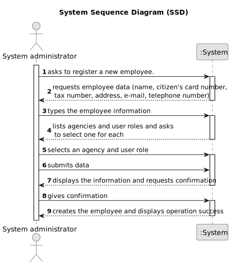

# US 003 - Register a new employee

## 1. Requirements Engineering

### 1.1. User Story Description

As a system administrator, I want to register a new employee

### 1.2. Customer Specifications and Clarifications 

**From the specifications document:**

>	The company's systems administrator will be responsible for registering all employees (specifying the name, the citizen's card number, the tax number, the address, the email address, the contact telephone number and the agency to which it is assigned).

**From the client clarifications:**

>	**Question:** The administrator when registering a new employee will also have to specify the category/office that he will perfom (for example agent, store manager, store network manager)?
>  
>	**Answer:** The administrator has to specify the role of the employee.

>   **Question:** When registering a new employee, all the required data (name, citizen's card number, etc...) have to be filled or exists not mandatory data?
>
>   **Answer:** Required/Mandatory data that should be filled when registering an employee: name, the citizen's card number, the tax number, the email address, the contact telephone number and the agency to which it is assigned.

>   **Question:** When registering a new employee, will the administrator set the respective employee password?
> 
>   **Answer:** The password should have seven characters in length and should be generated automatically. The password is sent to the employee by e-mail.

### 1.3. Acceptance Criteria

* **AC1:** All required fields must be filled in.
* **AC2:** All data must be valid.
* **AC3:** The tax number must follow the US's tax number criteria.

### 1.4. Found out Dependencies

* There are no dependencies.

### 1.5 Input and Output Data

**Input Data:**

* Typed data:
	* a name, 
	* a citizen card number, 
	* a tax number,
	* an address,
	* an email address,
	* a telephone number,

* Selected data:
	* The user's role
	* The user's agency

**Output Data:**

* The information given
* (In)Success of the operation

### 1.6. System Sequence Diagram (SSD)

### 1.7 Other Relevant Remarks

n/a