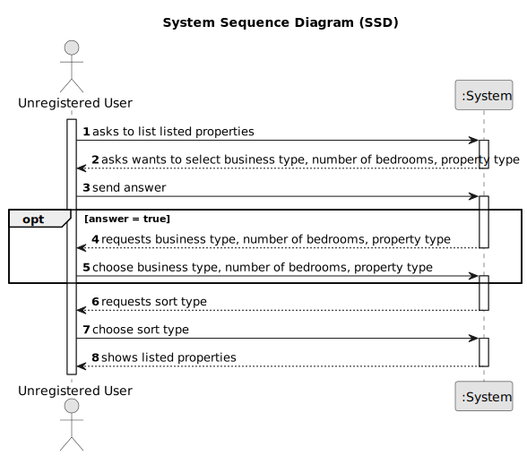

# US 001 - Register in the system 

## 1. Requirements Engineering

### 1.1. User Story Description

As an unregistered user, I want to register in the system to buy, sell or rent
properties.

### 1.2. Customer Specifications and Clarifications 

**From the specifications document:**

>	The real estate agent reviews advertisement requests, registers the information in the system and publishes the offer so that it is visible to all clients who visit the agency and use the application. All registered information, except the agency commission, can be accessed by the client who intends to buy or rent the property; the client is, then, responsible for being able to consult the properties by type, number of rooms, and sort by criteria such as price or the parish where the property is located.

**From the client clarifications:**

> **Question:** In the project's documentation it's mentioned that "All those who wish to use the application must be authenticated", but in the US1 it's said that an unregistered user can see a list of properties. Can users who aren't authenticated do this?
>  
> **Answer:** Non-authenticated users can only list properties.

### 1.3. Acceptance Criteria

* **AC1:** Unregistered user must choose sort type.
* **AC2:** Unregistered user can choose business type, property type and number of bedrooms.

### 1.4. Found out Dependencies

* None

### 1.5 Input and Output Data

**Input Data:**

* Typed data:
	* None
	
* Selected data:
    * Choosing business type (sell or lease)
    * Choosing type of property
    * Choosing number of bedrooms
    * Choosing sort type

**Output Data:**

* List of listed properties

### 1.6. System Sequence Diagram (SSD)

### 1.7 Other Relevant Remarks

* Unregistered users can only see the listed properties. They can't bid on properties unless they authenticate. 